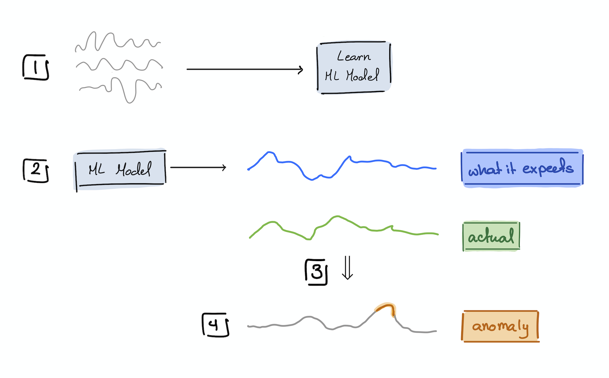
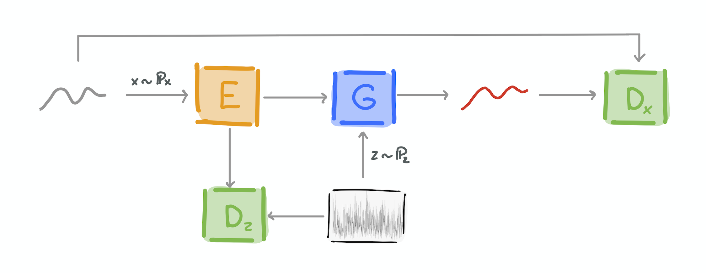
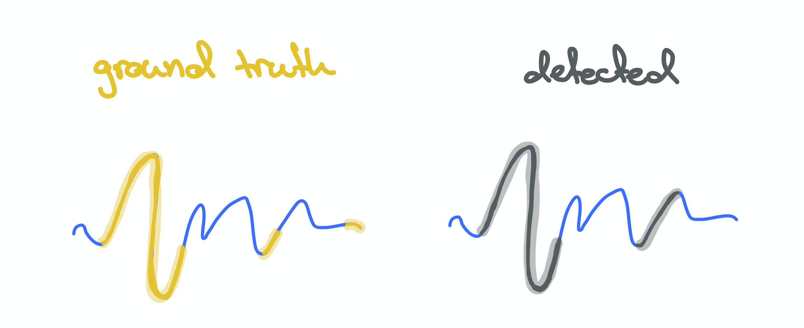

<p align="left">

<i>An open source project from Data to AI Lab at MIT.</i>
</p>

<p align="left">

</p>

[](https://pypi.org/search/?c=Development+Status+%3A%3A+2+-+Pre-Alpha)
[](https://badge.fury.io/py/orion-ml) 
[](https://pypi.python.org/pypi/orion-ml)
[](https://github.com/sintel-dev/Orion/actions?query=workflow%3A%22Run+Tests%22+branch%3Amaster)
[](https://pepy.tech/project/orion-ml)
[](https://mybinder.org/v2/gh/sintel-dev/Orion/master?filepath=tutorials)

# Orion

A machine learning library for unsupervised time series anomaly detection.

| Important Links                               |                                                                      |
| --------------------------------------------- | -------------------------------------------------------------------- |
| :computer: **[Website]**                      | Check out the Sintel Website for more information about the project. |
| :book: **[Documentation]**                    | Quickstarts, User and Development Guides, and API Reference.         |
| :star: **[Tutorials]**                        | Checkout our notebooks                                               |
| :octocat: **[Repository]**                    | The link to the Github Repository of this library.                   |
| :scroll: **[License]**                        | The repository is published under the MIT License.                   |
| [![][Slack Logo] **Community**][Community]    | Join our Slack Workspace for announcements and discussions.          |

[Website]: https://sintel.dev/
[Documentation]: https://sintel-dev.github.io/Orion
[Tutorials]: https://github.com/sintel-dev/Orion/tree/master/tutorials
[Repository]: https://github.com/sintel-dev/Orion
[License]: https://github.com/sintel-dev/Orion/blob/master/LICENSE
[Community]: https://join.slack.com/t/sintel-space/shared_invite/zt-q147oimb-4HcphcxPfDAM0O9_4PaUtw
[Slack Logo]: https://github.com/sintel-dev/Orion/blob/master/docs/images/slack.png

# Overview

Orion is a machine learning library built for *unsupervised time series anomaly detection*. With a given time series data, we provide a number of “verified” ML pipelines (a.k.a Orion pipelines) that identify rare patterns and flag them for expert review.

The library makes use of a number of **automated machine learning** tools developed under [Data to AI Lab at MIT](https://dai.lids.mit.edu/).

Read about using an Orion pipeline on NYC taxi dataset in a blog series:

[Part 1: Learn about unsupervised time series anomaly detection](https://t.co/yIFVM1oRwQ?amp=1) | [Part 2: Learn how we use GANs to solving the problem? ](https://link.medium.com/cGsBD0Fevbb) | [Part 3: How does one evaluate anomaly detection pipelines?](https://link.medium.com/FqCrFXMevbb)
:--------------------------------------:|:---------------------------------------------:|:--------------------------------------------:
       |              | 

**Notebooks:** Discover *Orion* through colab by launching our [notebooks](https://drive.google.com/drive/folders/1FAcCEiE1JDsqaMjGcmiw5a5XuGh13c9Q?usp=sharing)!

# Quickstart

## Install with pip

The easiest and recommended way to install **Orion** is using [pip](https://pip.pypa.io/en/stable/):

```bash
pip install orion-ml
```

This will pull and install the latest stable release from [PyPi](https://pypi.org/).


In the following example we show how to use one of the **Orion Pipelines**.

## Fit an Orion pipeline

We will load a demo data for this example:

```python3
from orion.data import load_signal

train_data = load_signal('S-1-train')
train_data.head()
```

which should show a signal with `timestamp` and `value`.
```
    timestamp     value
0  1222819200 -0.366359
1  1222840800 -0.394108
2  1222862400  0.403625
3  1222884000 -0.362759
4  1222905600 -0.370746
```

In this example we use `aer` pipeline and set some hyperparameters (in this case training epochs as 5).

```python3
from orion import Orion

hyperparameters = {
    'orion.primitives.aer.AER#1': {
        'epochs': 5,
        'verbose': True
    }
}

orion = Orion(
    pipeline='aer',
    hyperparameters=hyperparameters
)

orion.fit(train_data)
```

## Detect anomalies using the fitted pipeline
Once it is fitted, we are ready to use it to detect anomalies in our incoming time series:

```python3
new_data = load_signal('S-1-new')
anomalies = orion.detect(new_data)
```
> :warning: Depending on your system and the exact versions that you might have installed some *WARNINGS* may be printed. These can be safely ignored as they do not interfere with the proper behavior of the pipeline.

The output of the previous command will be a ``pandas.DataFrame`` containing a table of detected anomalies:

```
        start         end  severity
0  1402012800  1403870400  0.122539
```

# Leaderboard
In every release, we run Orion benchmark. We maintain an up-to-date leaderboard with the current scoring of the verified pipelines according to the benchmarking procedure.

We run the benchmark on **12** datasets with their known grounth truth. We record the score of the pipelines on each datasets. To compute the leaderboard table, we showcase the number of wins each pipeline has over the ARIMA pipeline.

| Pipeline                  |  Outperforms ARIMA |
|---------------------------|--------------------|
| AER                       |         11         |
| TadGAN                    |          7         |
| LSTM Dynamic Thresholding |          8         |
| LSTM Autoencoder          |          7         |
| Dense Autoencoder         |          7         |
| VAE                       |          6         |
| LNN                       |          7         |
| Matrix Profile            |          5         |
| [GANF](https://arxiv.org/pdf/2202.07857.pdf)                                                  |          5         |
| [Azure](https://azure.microsoft.com/en-us/products/cognitive-services/anomaly-detector/)      |          0         |


You can find the scores of each pipeline on every signal recorded in the [details Google Sheets document](https://docs.google.com/spreadsheets/d/1HaYDjY-BEXEObbi65fwG0om5d8kbRarhpK4mvOZVmqU/edit?usp=sharing). The summarized results can also be browsed in the following [summary Google Sheets document](https://docs.google.com/spreadsheets/d/1ZPUwYH8LhDovVeuJhKYGXYny7472HXVCzhX6D6PObmg/edit?usp=sharing).

# Resources

Additional resources that might be of interest:
* Learn about [benchmarking pipelines](BENCHMARK.md).
* Read about [pipeline evaluation](orion/evaluation/README.md).
* Find out more about [TadGAN](https://arxiv.org/pdf/2009.07769v3.pdf).

# Citation

If you use **AER** for your research, please consider citing the following paper:

Lawrence Wong, Dongyu Liu, Laure Berti-Equille, Sarah Alnegheimish, Kalyan Veeramachaneni. [AER: Auto-Encoder with Regression for Time Series Anomaly Detection](https://arxiv.org/pdf/2212.13558.pdf).

```
@inproceedings{wong2022aer,
  title={AER: Auto-Encoder with Regression for Time Series Anomaly Detection},
  author={Wong, Lawrence and Liu, Dongyu and Berti-Equille, Laure and Alnegheimish, Sarah and Veeramachaneni, Kalyan},
  booktitle={2022 IEEE International Conference on Big Data (IEEE BigData)},
  pages={1152-1161},
  doi={10.1109/BigData55660.2022.10020857},
  organization={IEEE},
  year={2022}
}
```

If you use **TadGAN** for your research, please consider citing the following paper:

Alexander Geiger, Dongyu Liu, Sarah Alnegheimish, Alfredo Cuesta-Infante, Kalyan Veeramachaneni. [TadGAN - Time Series Anomaly Detection Using Generative Adversarial Networks](https://arxiv.org/pdf/2009.07769v3.pdf).

```
@inproceedings{geiger2020tadgan,
  title={TadGAN: Time Series Anomaly Detection Using Generative Adversarial Networks},
  author={Geiger, Alexander and Liu, Dongyu and Alnegheimish, Sarah and Cuesta-Infante, Alfredo and Veeramachaneni, Kalyan},
  booktitle={2020 IEEE International Conference on Big Data (IEEE BigData)},
  pages={33-43},
  doi={10.1109/BigData50022.2020.9378139},
  organization={IEEE},
  year={2020}
}
```

If you use **Orion** which is part of the **Sintel** ecosystem for your research, please consider citing the following paper:

Sarah Alnegheimish, Dongyu Liu, Carles Sala, Laure Berti-Equille, Kalyan Veeramachaneni. [Sintel: A Machine Learning Framework to Extract Insights from Signals](https://dl.acm.org/doi/pdf/10.1145/3514221.3517910).
```
@inproceedings{alnegheimish2022sintel,
  title={Sintel: A Machine Learning Framework to Extract Insights from Signals},
  author={Alnegheimish, Sarah and Liu, Dongyu and Sala, Carles and Berti-Equille, Laure and Veeramachaneni, Kalyan},  
  booktitle={Proceedings of the 2022 International Conference on Management of Data},
  pages={1855–1865},
  numpages={11},
  publisher={Association for Computing Machinery},
  doi={10.1145/3514221.3517910},
  series={SIGMOD '22},
  year={2022}
}
```
